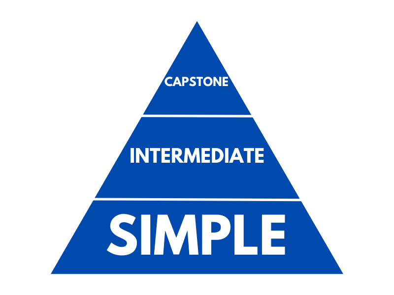

# 3 Levels of Portfolio Projects

This is a compilation of the three different types of portfolio projects you can create. The explanation for the different types are contained in [this](https://youtu.be/RYE0QQKJI9o) YouTube video.

P.S. If you're interested in contributing go ahead and create a pull request :-)

## Level 1: Basic

### Examples:
- Static website
    - Personal Website
    - Website for Local Business (Real or Create a Fake Business)
- Digital Clock
- Todo App
- Expense Tracker
- Vowel Counter
- Pig Latin Generator
- Weight Tracker App
- Recipes App
- Rock, Paper, Scissors Game
- [Note Taking App](https://andysterks.github.io/note-taking-app/)

## Level 2: Intermediate

### Examples:
- Space Invaders Game
- Snake Game
- Tetris Game
- Pong Game
- Calculator
- Web Scraper
- Flash Card App
- Address Book (Contact Manager)

## Level 3: Capstone

### Examples
- Facebook Clone
- Twitter Clone
- LinkedIn Clone
- Instagram Clone
- Online Forum
- "Fake" E-Commerce Store
- Crypto Tracker
- Airline/Hotel Reservation System
- WYSIWG (What you see is what you get) Editor

## Projects Idea References
- [A list of sample Web App Ideas](https://flaviocopes.com/sample-app-ideas/) from Flavio Copes
- [Martyr2'S Mega Project Ideas List!](https://www.dreamincode.net/forums/topic/78802-martyr2s-mega-project-ideas-list/?utm_source=pocket_mylist) from dreamincode.net
- [40 Side Project Ideas for Software Engineers](https://www.codementor.io/@npostolovski/40-side-project-ideas-for-software-engineers-g8xckyxef?utm_source=pocket_mylist) from codementor.io
- [30 Developer Portfolio Project Ideas](https://dev.to/allthecode/30-developer-portfolio-project-ideas-3kh5?utm_source=pocket_mylist) from Simon Barker
